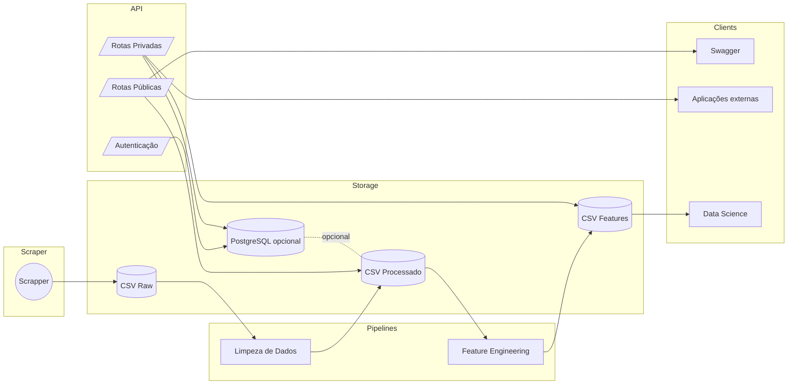

# Tech Challenge Book API
Plataforma FastAPI criada para o Tech Challenge, focada em expor e enriquecer um catálogo de livros obtido via web scraping do site `books.toscrape.com`. O projeto combina coleta automatizada, pipelines de dados, autenticação JWT e rotas especializadas para análises e preparação de dados para Machine Learning.

## Links Rápidos
- **Link do Deploy**: [https://book-api-mlet.onrender.com](https://book-api-mlet.onrender.com/)
- **Vídeo de Demonstração**: *TODO*
- **Documentação Completa (Wiki)**
  - [Home da Wiki](https://github.com/andrevberaldo/tech-challenge-book-api/wiki/Tech-Challenge-Book-API)
  - [Visão Geral e Arquitetura](https://github.com/andrevberaldo/tech-challenge-book-api/wiki/Vis%C3%A3o-Geral-e-Arquitetura)
  - [Instalação e Configuração](https://github.com/andrevberaldo/tech-challenge-book-api/wiki/Instala%C3%A7%C3%A3o-e-Configura%C3%A7%C3%A3o)
  - [Documentação das Rotas](https://github.com/andrevberaldo/tech-challenge-book-api/wiki/Documenta%C3%A7%C3%A3o-das-Rotas)
  - [Exemplos de Chamadas HTTP](https://github.com/andrevberaldo/tech-challenge-book-api/wiki/Exemplos-de-Chamadas-HTTP)
  - [Operação e Execução](https://github.com/andrevberaldo/tech-challenge-book-api/wiki/Opera%C3%A7%C3%A3o-e-Execu%C3%A7%C3%A3o)

> A Wiki acompanha este README e aprofunda todos os tópicos: arquitetura, fluxo de dados, automações, exemplos de requisições e checklists operacionais.

## Objetivos do Projeto
- Disponibilizar endpoints públicos para consulta do catálogo de livros já processado.
- Expor rotas privadas (com JWT) para estatísticas avançadas, datasets de ML e automações (scrapper/pipeline).
- Demonstrar boas práticas de engenharia de dados: coleta, limpeza, feature engineering e consumo via API.
- Facilitar deploy local e containerizado, com suporte opcional a PostgreSQL para persistência de usuários e tokens.

## Principais Recursos
- **Rotas públicas**: listagem, busca e detalhamento de livros (`/api/v1/books`, `/api/v1/categories`, etc.).
- **Rotas privadas**: estatísticas, datasets de ML, disparo da pipeline e scrapper, acesso a diagramas HTML.
- **Autenticação JWT**: emissão e renovação de tokens (`/api/v1/auth/login` e `/api/v1/auth/refresh`).
- **Pipeline de dados**: limpeza, validação, geração de features e invalidação automática de caches.
- **Scrapper resiliente**: `requests` + `BeautifulSoup` com backoff, salvando CSV bruto em `src/data/raw`.
- **Observabilidade pronta**: dependências de OpenTelemetry já configuradas para instrumentação opcional.

## Arquitetura em Alto Nível
```
src/
├─ app.py                 # Configura FastAPI e registra routers
├─ routes/                # Endpoints públicos e privados
├─ domain/                # Regras de negócio, serviços e repositórios
├─ scripts/               # Pipelines, scrapper e utilitários de ML
├─ data/                  # Artefatos raw, processed e features
├─ docs/                  # Diagramas (HTML) servidos pelas rotas privadas
└─ templates/             # Landing page pública
```

Fluxo de dados:
```
Scrapper → src/data/raw/all_books_with_images.csv
Pipeline (limpeza + features) → processed/books_processed.csv → features/books_features.csv
Rotas → servem os CSVs com cache e conversões em tempo real
```

### Diagrama de Arquitetura (Mermaid)


## Como Reproduzir em Ambiente Local (sem Docker)
1. Crie e ative o ambiente virtual:
  ```bash
  python -m venv .venv
  # Linux/macOS
  source .venv/bin/activate
  # Windows PowerShell
  .\.venv\Scripts\Activate.ps1
  ```
2. Instale as dependências:
  ```bash
  pip install -r requirements.txt
  ```
3. Crie o `.env` na raiz:
  ```ini
  JWT_SECRET=secret_here
  USE_DATABASE=False
  ```
4. Inicie a API:
  - Linux/macOS: `./devops/start_local.sh`
  - Windows PowerShell: `./devops/start_local.ps1`

A aplicação ficará disponível em `http://localhost:4000` com documentação Swagger em `http://localhost:4000/docs`.

## Execução com Docker Compose
1. Ajuste o `.env` com as credenciais necessárias:
  ```ini
  JWT_SECRET=secret_here
  USE_DATABASE=False
  DB_HOST=postgres
  DB_USER=admin
  DB_PASSWORD=admin
  ```
2. Suba os serviços:
  ```bash
  docker compose up --build
  ```
3. Serviços expostos:
  - API: `http://localhost:4000`
  - PostgreSQL: `localhost:5432`
  - pgAdmin4: `http://localhost:5050` (login `admin@admin.com` / senha `admin`)

Para provisionar usuários/tokens no banco, execute `init/01-schema.sql` e `init/02-seed.sql` dentro do container Postgres.

## Variáveis de Ambiente
| Nome | Obrigatório | Padrão | Descrição |
|------|-------------|--------|-----------|
| `JWT_SECRET` | Sim | — | Chave usada para assinar e validar JWT. |
| `USE_DATABASE` | Não | `False` | Quando `True`, utiliza PostgreSQL em vez de repositórios em memória. |
| `BOOKS_CSV_PATH` | Não | `src/data/raw/all_books_with_images.csv` | Fonte bruta usada no health-check. |
| `BOOKS_PROCESSED_PATH` | Não | `src/data/processed/books_processed.csv` | Dataset servido pelas rotas públicas. |
| `BOOK_SCRAPER_OUTPUT` | Não | `src/data/raw` | Diretório de saída do scrapper. |
| `GIT_HASH` | Não | `unknown-version` | Hash exibido em `/api/v1/version`. |
| `DB_HOST` | Quando `USE_DATABASE=True` | — | Host do PostgreSQL. |
| `DB_PORT` | Não | `5432` | Porta do PostgreSQL. |
| `DB_USER` | Quando `USE_DATABASE=True` | — | Usuário do PostgreSQL. |
| `DB_PASSWORD` | Quando `USE_DATABASE=True` | — | Senha do PostgreSQL. |
| `DB_NAME` | Não | `book-api` | Nome do banco. |
| `DB_SSLMODE` | Não | `prefer` | Modo SSL para psycopg (health-check). |
| `DB_CONNECT_TIMEOUT` | Não | `3` | Timeout (s) para psycopg. |
| `DB_TCP_TIMEOUT` | Não | `2.5` | Timeout (s) para fallback TCP. |

## Autenticação e Autorização
1. `GET /api/v1/auth/login` — exige `Authorization: Basic`, retorna `accessToken` (curta duração) e `refreshToken`.
2. `GET /api/v1/auth/refresh` — recebe `Authorization: Bearer <refreshToken>` e devolve novo `accessToken`.
3. Rotas privadas (`/api/v1/stats/*`, `/api/v1/ml/*`, `/api/v1/data-process`, `/api/v1/scrapper`, `/api/v1/diagrams/*`) validam o access token via `JWTUtils.validate_token`.
4. Com `USE_DATABASE=True`, os repositórios `DBAuthRepository` e `DBUserRepository` passam a persistir tokens e usuários no PostgreSQL; caso contrário, são usados repositórios em memória.

## Endpoints Principais
| Método | Rota | Descrição | Autenticação |
|--------|------|-----------|--------------|
| GET | `/` | Landing page com integrantes e link da doc. | Pública |
| GET | `/api/v1/health` | Health-check do CSV e banco (quando configurado). | Pública |
| GET | `/api/v1/books` | Lista completa de livros processados. | Pública |
| GET | `/api/v1/books/search` | Busca por título e/ou categoria. | Pública |
| GET | `/api/v1/books/{id}` | Detalhes de um livro por ID. | Pública |
| GET | `/api/v1/categories` | Lista de categorias disponíveis. | Pública |
| GET | `/api/v1/auth/login` | Emite access/refresh tokens via Basic Auth. | Basic |
| GET | `/api/v1/stats/overview` | Estatísticas gerais do catálogo. | Bearer |
| GET | `/api/v1/ml/features` | Dataset de features para ML. | Bearer |
| GET | `/api/v1/diagrams/*` | Diagramas HTML do projeto. | Bearer |
| PUT | `/api/v1/data-process` | Dispara pipeline de processamento de dados. | Bearer |
| PUT | `/api/v1/scrapper` | Inicia scraping em background. | Bearer |

Consulte a [Documentação das Rotas](https://github.com/andrevberaldo/tech-challenge-book-api/wiki/Documenta%C3%A7%C3%A3o-das-Rotas) para parâmetros, payloads e respostas detalhadas.

## Pipeline de Dados e Scrapper
- **Scrapper**: disparo via `PUT /api/v1/scrapper` ou execução direta `python -c "from src.scripts.scrapper_lib import trigger_scrap; trigger_scrap()"`.
- **Pipeline completa**: `PUT /api/v1/data-process` ou `python -m src.scripts.data_processing_pipeline`.
- **Artefatos gerados**: diretórios `src/data/raw/`, `src/data/processed/`, `src/data/features/`.
- **Cache inteligente**: endpoints invalidam caches automaticamente com base no `mtime` dos arquivos.

## Testes e Qualidade
```bash
pytest
```
- `tests/unit_tests/`: cobre pipelines, estatísticas e rotas críticas.
- `tests/smoke_tests/`: verificação rápida pós-deploy.
- `tests/run_tests.py`: entry point auxiliar para execução dos testes.

## Estrutura de Pastas (resumo)
```
devops/            Scripts de bootstrap (Linux/Windows)
init/              DDL e seeds do PostgreSQL
notebooks/         Análises exploratórias e estudos prévios
src/               Código-fonte da API, domínio e pipelines
tests/             Suite de testes unitários e smoke
wiki/              Conteúdo pronto para a aba Wiki do GitHub
```

## 🙌 Contribuição
- Abra issues ou pull requests descrevendo claramente a alteração proposta.
- Garanta que os testes relevantes estejam passando (`pytest`).
- Atualize a Wiki sempre que novos fluxos ou diagramas forem adicionados.

---
Projeto mantido por `andrevberaldo` e colaboradores do Tech Challenge.

