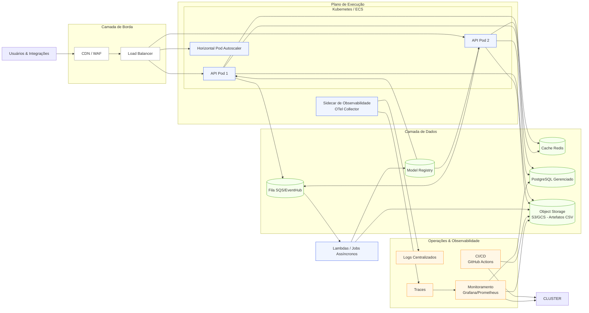

# Arquitetura para Escalabilidade Futura

```mermaid
graph LR
    subgraph Edge[Camada de Borda]
        CDN[CDN / WAF]
        LB[Load Balancer]
    end

    subgraph Compute[Plano de Execução]
        subgraph Cluster[Kubernetes / ECS]
            API1[API Pod 1]
            API2[API Pod 2]
            APIHPA[Horizontal Pod Autoscaler]
        end
        SIDE[Sidecar de Observabilidade
OTel Collector]
    end

    subgraph Data[Camada de Dados]
        CACHE[(Cache Redis)]
        DB[(PostgreSQL Gerenciado)]
        STORAGE[(Object Storage
S3/GCS - Artefatos CSV)]
        QUEUE[(Fila SQS/EventHub)]
        REGISTRY[(Model Registry)]
    end

    subgraph Tooling[Operações & Observabilidade]
        CI[CI/CD
GitHub Actions]
        MON[Monitoramento
Grafana/Prometheus]
        LOG[Logs Centralizados]
        TRACE[Traces]
    end

    CLIENTS[Usuários & Integrações] --> CDN --> LB --> API1
    LB --> API2
    LB --> APIHPA

    API1 --> CACHE
    API1 --> DB
    API1 --> STORAGE
    API1 --> QUEUE
    API2 --> CACHE
    API2 --> DB
    API2 --> STORAGE
    API2 --> QUEUE

    QUEUE --> WORKERS[Lambdas / Jobs Assíncronos]
    WORKERS --> STORAGE
    WORKERS --> REGISTRY

    CI --> CLUSTER
    CI --> STORAGE

    SIDE --> TRACE
    SIDE --> LOG
    MON --> CLUSTER
    MON --> DB
    MON --> STORAGE
    TRACE --> MON

    REGISTRY --> API1
    REGISTRY --> API2

    classDef infra fill:#ffffff,stroke:#8c8c8c,stroke-width:1px;
    classDef compute fill:#f0f5ff,stroke:#2f54eb,stroke-width:1px;
    classDef data fill:#f6ffed,stroke:#389e0d,stroke-width:1px;
    classDef ops fill:#fff7e6,stroke:#fa8c16,stroke-width:1px;

    class CDN,LB infra;
    class API1,API2,APIHPA,SIDE,WORKERS compute;
    class CACHE,DB,STORAGE,QUEUE,REGISTRY data;
    class CI,MON,LOG,TRACE ops;
```
