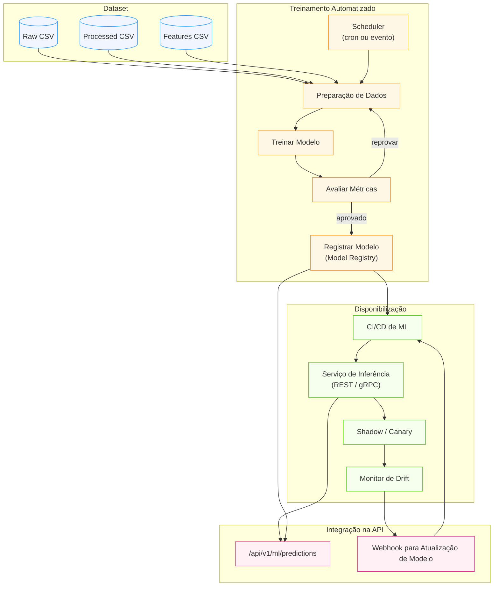

# Plano de Integração com Modelos de ML

```mermaid
flowchart TD
    subgraph Dataset
        RAW[(Raw CSV)]
        PROC[(Processed CSV)]
        FEAT[(Features CSV)]
    end

    subgraph TrainingPipeline[Treinamento Automatizado]
        SCHED["Scheduler<br/>(cron ou evento)"]
        PREP[Preparação de Dados]
        TRAIN[Treinar Modelo]
        EVAL[Avaliar Métricas]
        REG["Registrar Modelo<br/>(Model Registry)"]
    end

    subgraph Deployment[Disponibilização]
        CI[CI/CD de ML]
        SERVE["Serviço de Inferência<br/>(REST / gRPC)"]
        SHADOW[Shadow / Canary]
        MON[Monitor de Drift]
    end

    subgraph API[Integração na API]
    ROUTE_PRED["/api/v1/ml/predictions"]
    WEBHOOK["Webhook para Atualização de Modelo"]
    end

    RAW --> PREP
    PROC --> PREP
    FEAT --> PREP
    SCHED --> PREP
    PREP --> TRAIN --> EVAL
    EVAL -->|aprovado| REG
    EVAL -->|reprovar| PREP
    REG --> CI --> SERVE
    SERVE --> SHADOW --> MON
    SERVE --> ROUTE_PRED
    MON --> WEBHOOK --> CI
    REG --> ROUTE_PRED

    classDef data fill:#f0f5ff,stroke:#1890ff;
    classDef ml fill:#fff7e6,stroke:#fa8c16;
    classDef deploy fill:#f6ffed,stroke:#52c41a;
    classDef api fill:#fff0f6,stroke:#eb2f96;

    class RAW,PROC,FEAT data;
    class PREP,TRAIN,EVAL,REG,SCHED ml;
    class CI,SERVE,SHADOW,MON deploy;
    class ROUTE_PRED,WEBHOOK api;
```
