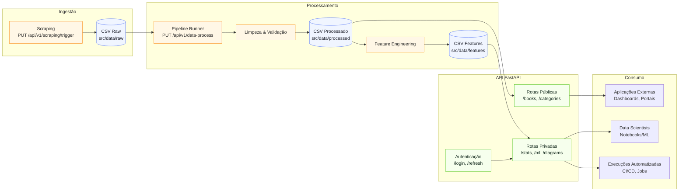

# Pipeline: Ingestão → Processamento → API → Consumo

```mermaid
flowchart LR
    subgraph Ingestao[Ingestão]
        SCR[Scraping
PUT /api/v1/scraping/trigger]
        RAW[(CSV Raw
src/data/raw)]
    end

    subgraph Processamento[Processamento]
        PIPE[Pipeline Runner
PUT /api/v1/data-process]
        CLEAN[Limpeza & Validação]
        PROC[(CSV Processado
src/data/processed)]
        FEATENG[Feature Engineering]
        FEAT[(CSV Features
src/data/features)]
    end

    subgraph API[API FastAPI]
        ROUTES_PUBLIC[Rotas Públicas
/books, /categories]
        ROUTES_PRIVATE[Rotas Privadas
/stats, /ml, /diagrams]
        AUTH[Autenticação
/login, /refresh]
    end

    subgraph Consumo[Consumo]
        CLIENTS[Aplicações Externas
Dashboards, Portais]
        DS[Data Scientists
Notebooks/ML]
        OPS[Execuções Automatizadas
CI/CD, Jobs]
    end

    SCR --> RAW
    RAW --> PIPE
    PIPE --> CLEAN --> PROC
    PROC --> FEATENG --> FEAT
    FEAT --> ROUTES_PRIVATE
    PROC --> ROUTES_PUBLIC
    AUTH --> ROUTES_PRIVATE

    ROUTES_PUBLIC --> CLIENTS
    ROUTES_PRIVATE --> DS
    ROUTES_PRIVATE --> OPS

    classDef storage fill:#f0f5ff,stroke:#4c6ef5,stroke-width:1px,color:#1c1f2a;
    classDef service fill:#fff7e6,stroke:#fa8c16,stroke-width:1px,color:#262626;
    classDef endpoint fill:#f6ffed,stroke:#52c41a,stroke-width:1px,color:#10261a;
    class RAW,PROC,FEAT storage;
    class SCR,PIPE,CLEAN,FEATENG service;
    class ROUTES_PUBLIC,ROUTES_PRIVATE,AUTH endpoint;
```
