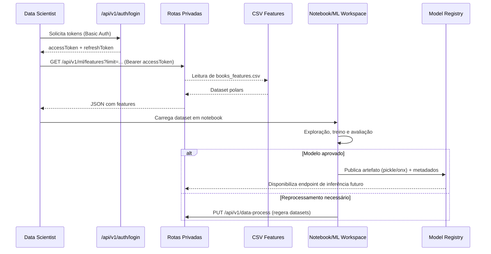

# Cenário de Uso: Cientistas de Dados / ML

```mermaid
sequenceDiagram
    participant DS as Data Scientist
    participant AUTH as /api/v1/auth/login
    participant API as Rotas Privadas
    participant STORAGE as CSV Features
    participant LAB as Notebook/ML Workspace
    participant REG as Model Registry

    DS->>AUTH: Solicita tokens (Basic Auth)
    AUTH-->>DS: accessToken + refreshToken

    DS->>API: GET /api/v1/ml/features?limit=... (Bearer accessToken)
    API-->>STORAGE: Leitura de books_features.csv
    STORAGE-->>API: Dataset polars
    API-->>DS: JSON com features

    DS->>LAB: Carrega dataset em notebook
    LAB->>LAB: Exploração, treino e avaliação

    alt Modelo aprovado
        LAB->>REG: Publica artefato (pickle/onx) + metadados
        REG-->>API: Disponibiliza endpoint de inferência futuro
    else Reprocessamento necessário
        LAB->>API: PUT /api/v1/data-process (regera datasets)
    end
```
